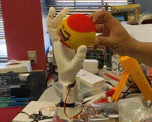

## Overview

The ENEE101 Spring 2023 class at the University of Maryland was tasked with
programming the most impressive procedure for a robot hand to follow.
The hand in question is driven by an Arduino Uno, and has the following
movement options:

* Curling of the thumb and each finger
* Flexing of the wrist back and fourth
* Turning of the wrist left and right

The rules were simple: no hardware modifications of the hand were allowed.
Everything else, including serial communication, was fair game.

My goal for this project was simple: control the hand using a game controller.
To accomplish this, I first turned to the Arduino procedures.  In essence,
the Arduino decides what to do, and to what intensity, based on serial input.
Then, I needed something on my computer to both process controller input and
send the associated serial information.  I chose Python along with the pygame
and pyserial APIs.  The Python program brings up a pygame window, processes
controller inputs on said window, and sends the appropriate serial information
to the Arduino.

I won the competition by a unanimous vote from the ENEE101 teaching team.
The code is provided in hopes that it may be useful to someone for their
own serial communication projects, or to encourage further developments
in future robotics competitions in ENEE101.


## Usage

Acquire the robot hand from Dr. Romel Gomez at UMD (with permission of course),
or build your own.  Unfortunately, build instructions are currently not
available.  If tangible results aren't a requirement, or the Arduino code is
modified to work with your own project, then the minimum requirement is an
Arduino.

Clone the repository using

```sh
git clone https://github.com/WGeckle80/enee101-robot-hand-control.git
```

Install the [Arduino IDE](https://www.arduino.cc/en/software) ([Linux users
must add themselves to the dialout group](https://support.arduino.cc/hc/en-us/articles/360016495679-Fix-port-access-on-Linux)).
Install the `Adafruit PWM Servo Driver Library`.  Upload the sketch
`robot_hand_procedure.ino` from the `robot_hand_procedure` directory to a
target Arduino, and take note of its port name.

Install Python 3 from <https://www.python.org>
(`python3` is installed by default in many Linux distributions; install
`python3-pip` if applicable).  Uninstall `pygame` using

```sh
pip uninstall pygame
```

Install the required libraries with the following terminal commands:

```sh
pip install -U pygame-ce
pip install -U pyserial
```

In the terminal, run `robot_hand_control.py` in the `control` directory with
an extra command line parameter of the Arduino serial port name.
For example, on Windows with a serial port of `COM3`,

```sh
py robot_hand_control.py COM3
```

and on Linux with a serial port of `/dev/ttyACM0`,

```sh
python3 robot_hand_control.py /dev/ttyACM0
```

If the program launched and communication was successful, the control
parameter percentages will be shown on screen.

The default controls are found, and can be modified, in the provided
`config.ini` configuration file.  The default controller inputs are
based on the Linux interpretation of Xinput controllers.

Below is a short demo of everything working:




## Acknowledgements

The robot hand used for this competition was developed by Matthew Schuyler,
with development overseen by Dr. Romel Gomez.  I would like to thank them
for developing the hand and putting on the competition.  Additionally,
I would like to thank the entire ENEE101 Spring 2023 teaching team,
with a special mention to my UTF, Emma Griffith.


## References

Adafruit. (2023).  Adafruit PCA9685 PWM Servo Driver Library, version 2.4.1.
<https://github.com/adafruit/Adafruit-PWM-Servo-Driver-Library>

Arduino.  (2023).  Arduino.  <https://www.arduino.cc/>

Arduino.  (2023).  Wire, version 1.0.
<https://www.arduino.cc/reference/en/language/functions/communication/wire/>

pygame-community.  (2023).  pygame - Community Edition, version 2.2.1.
<https://github.com/pygame-community/pygame-ce>

pyserial.  (2021).  pySerial, version 3.5.
<https://github.com/pyserial/pyserial>

Python Software Foundation.  (2023).  Python Language Reference, version 3.10.
Available at <https://www.python.org/>

